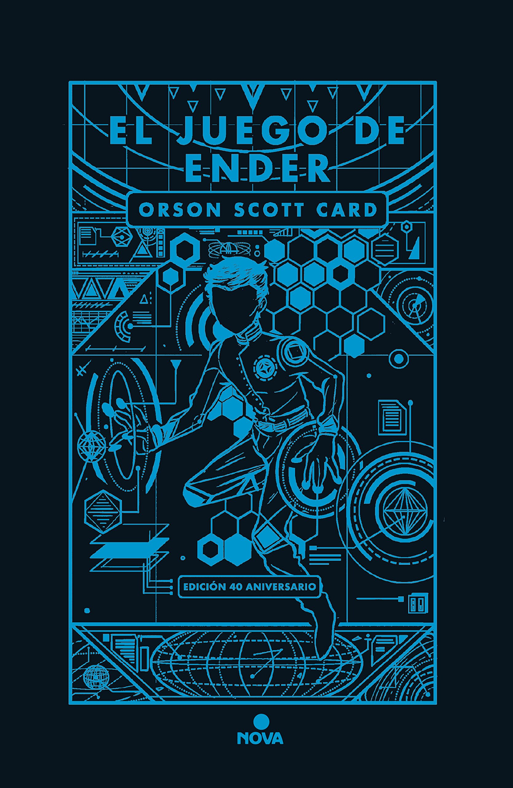

# El Juego de Ender #

----

## Sinopsis ##

*La novela más famosa de ciencia ficción moderna: un clásico indiscutible, ganadora de los premios Hugo, Nebula y SF Chronicle. La Tierra se ve amenazada por una raza extraterrestre, los Insectores, que se comunican telepáticamente y consideran no tener nada en común con los humanos, a quienes pretenden destruir.*